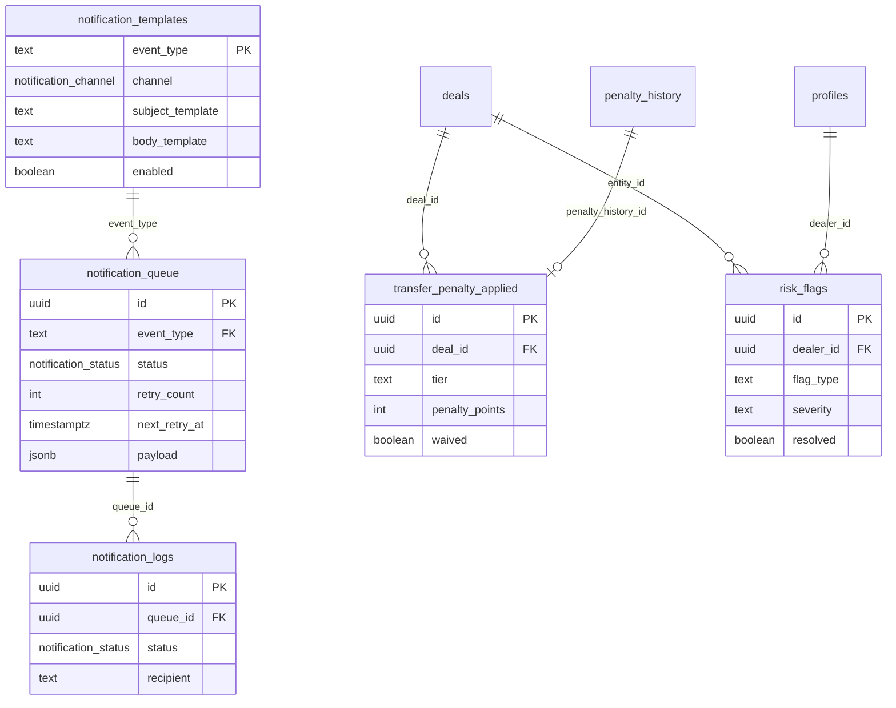

# ER 追記（運営自動化）

```mermaid
erDiagram
  notification_templates ||--o{ notification_queue : event_type
  notification_queue ||--o{ notification_logs : queue_id
  deals ||--o{ transfer_penalty_applied : deal_id
  deals ||--o{ risk_flags : entity_id
  profiles ||--o{ risk_flags : dealer_id
  penalty_history ||--o| transfer_penalty_applied : penalty_history_id

  notification_templates {
    text event_type PK
    notification_channel channel
    text subject_template
    text body_template
    boolean enabled
  }

  notification_queue {
    uuid id PK
    text event_type FK
    notification_status status
    int retry_count
    timestamptz next_retry_at
    jsonb payload
  }

  notification_logs {
    uuid id PK
    uuid queue_id FK
    notification_status status
    text recipient
  }

  transfer_penalty_applied {
    uuid id PK
    uuid deal_id FK
    text tier
    int penalty_points
    boolean waived
  }

  risk_flags {
    uuid id PK
    uuid dealer_id FK
    text flag_type
    text severity
    boolean resolved
  }
```
