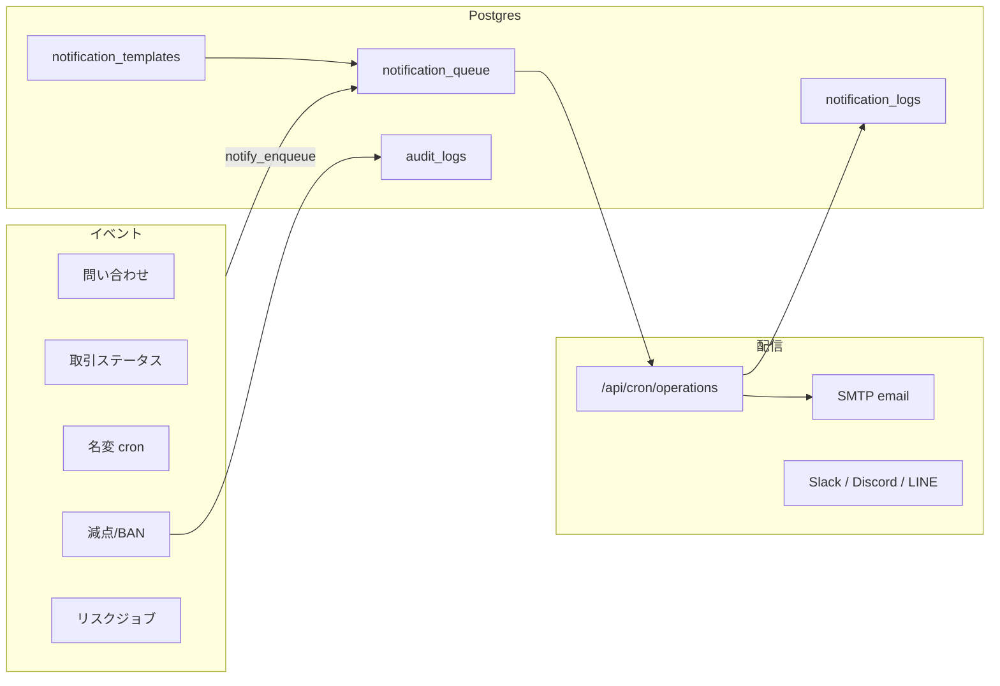

# Moto-Hub 運営自動化（Phase: Operations）

BtoB中古バイク流通の **安全運営・事故早期検知・通知基盤** です。

## アーキテクチャ



### 設計方針

| 原則 | 実装 |
|------|------|
| transparency | 取引ステータスごとに通知・監査ログ |
| auditability | `audit_logs` / `notification_logs` / `penalty_history` |
| trust | 名変超過の段階的自動減点 + 14日レビュー |
| operational safety | 日次 cron + 手動ジョブ（管理画面） |
| extensibility | `notification_channel` enum（email 以外を後付け） |

## 通知イベント

| 区分 | event_type |
|------|------------|
| 問い合わせ | `inquiry.created`, `inquiry.closed` |
| 取引 | `deal.created`, `deal.funded`, `deal.handover_done`, … |
| 名変 | `transfer.due_soon`, `transfer.due_today`, `transfer.overdue`, `transfer.penalty_applied`, `transfer.review_required` |
| クレーム | `complaint.created`, `complaint.approved`, `complaint.rejected` |
| 信用 | `credit.badge_yellow`, `credit.badge_red`, `credit.ban`, `credit.penalty` |
| リスク | `risk.detected` |
| 加盟審査 | `dealer.membership_submitted` |

## 名変超過 → 自動減点

日次 `run_transfer_compliance_job()`:

| 条件 | 処理 |
|------|------|
| 期限3日前 | 通知 `transfer.due_soon` |
| 当日 | 通知 `transfer.due_today` |
| 超過 | `transfer_overdue` フラグ + 通知 |
| 超過3日 | **-5点**（`transfer_penalty_applied.tier=overdue_3d`、二重防止） |
| 超過7日 | **-10点**（`overdue_7d`） |
| 超過14日 | 運営レビュー必須 + `risk_flags` + Yellow候補記録 |

手動解除: `admin_waive_transfer_penalty(deal_id, tier, note)`

## funded 後の連絡先開示

RPC `get_deal_party_contacts(deal_id)` — 当事者のみ。  
`funded` 以降のステータスで店舗名・担当・電話・メールを双方に返す。

## KPI

`/admin/dashboard` — 月次出品・成約・funded・名変超過・クレーム・Yellow/Red/BAN・リスク一覧。

## Cron（Vercel）

`vercel.json`: 毎日 01:00 UTC → `GET /api/cron/operations`

ヘッダー: `Authorization: Bearer $CRON_SECRET` または `x-cron-secret`

処理順:

1. `run_transfer_compliance_job`
2. `run_risk_detection_job`
3. `notification_queue` → SMTP（指数バックオフリトライ、最大5回）

## 環境変数

```env
SUPABASE_SERVICE_ROLE_KEY=
CRON_SECRET=
SMTP_HOST=
SMTP_PORT=587
SMTP_USER=
SMTP_PASS=
SMTP_FROM=info@moto-hub.jp
NOTIFICATION_ADMIN_EMAILS=info@moto-hub.jp,rideworks@rideworks.xyz
```

## マイグレーション

- `019_operations_automation.sql` — 通知テーブル・テンプレ seed・減点通知フック
- `019b_operations_jobs.sql` — 名変ジョブ・取引トリガ・連絡先 RPC・リスク・RLS

## 運営フロー（日次）

1. Cron が名変・リスク・メール送信を実行
2. 管理者は `/admin/dashboard` で KPI・リスク確認
3. 14日超過・クレーム集中は `/admin/credit` で個別対応
4. 誤減点は管理画面から `admin_waive_transfer_penalty`（今後 UI 拡張）
