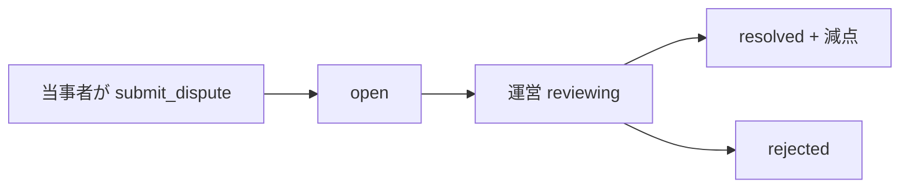

# Phase4: 業販市場型運営

## 思想

- **管理しすぎない** — 書類・虚偽・瑕疵・不正のみ
- **SNS型指標なし** — 公開成約率・返信率・ランキングなし
- **信用は可視化** — ランク・点数・査定済・距離減算（出品単位）

## データモデル

- `disputes` — 取引当事者からの申告
- `penalty_logs` — 減点記録（`score_delta` は負の整数）

## フロー

## 名変

引渡後・翌週金曜期限。超過時は既存 `run_transfer_compliance_job` で通知・自動減点・dispute 候補。

## 画面

| パス | 用途 |
|------|------|
| `/disputes/new?deal=` | 申告 |
| `/my/dashboard` | 本人統計 |
| `/admin/disputes` | 運営審査 |
